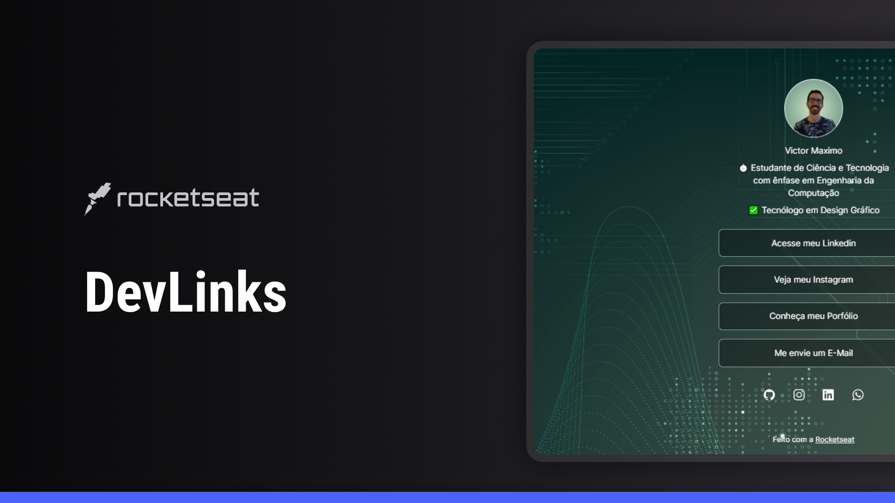

<h1 align="center"> DevLinks </h1>

Programa exclusivo e gratuito, promovido pela Rocketseat para ensino de tecnologias WEB.

<a href="#-tecnologias">Tecnologias</a>&nbsp;&nbsp;&nbsp;|&nbsp;&nbsp;&nbsp;
<a href="#-projeto">Projeto</a>&nbsp;&nbsp;&nbsp;|&nbsp;&nbsp;&nbsp;
<a href="#-layout">Layout</a>&nbsp;&nbsp;&nbsp;|&nbsp;&nbsp;&nbsp;
<a href="#memo-licença">Licença</a>

 

## Tecnologias

Esse projeto foi desenvolvido com as seguintes tecnologias:

- HTML
- CSS
- Git e Github
- Figma

## Projeto

O DevLinks é um agregador de links para usar como cartão de visitas online.

## Layout

Você pode visualizar o layout do projeto através
[desse link](https://www.figma.com/community/file/1187422022288947321/devlinks-projeto-discover).
É necessário ter uma conta no [Figma](https://www.figma.com)

## :memo: Licença

Esse projeto está sob a licença MIT

---

Feito com a Rocketseat :wave:
